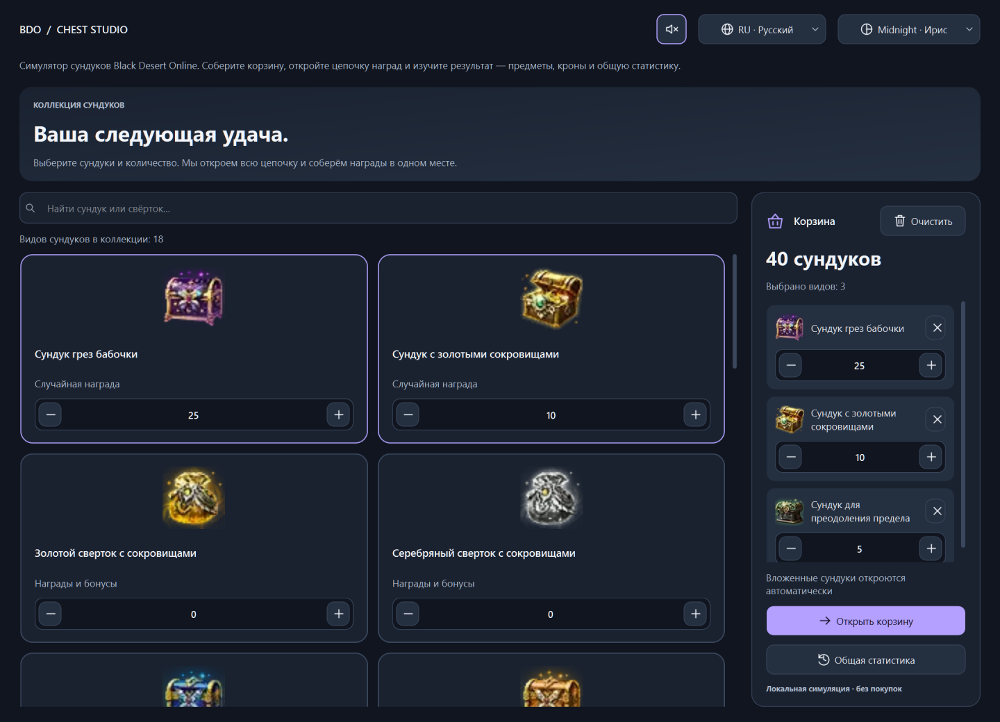
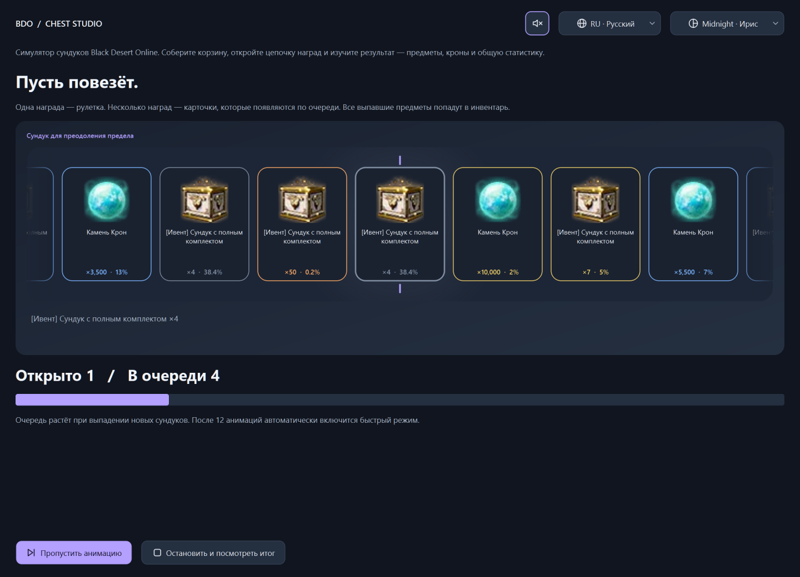
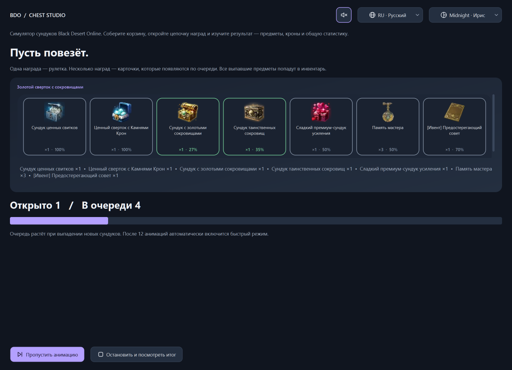
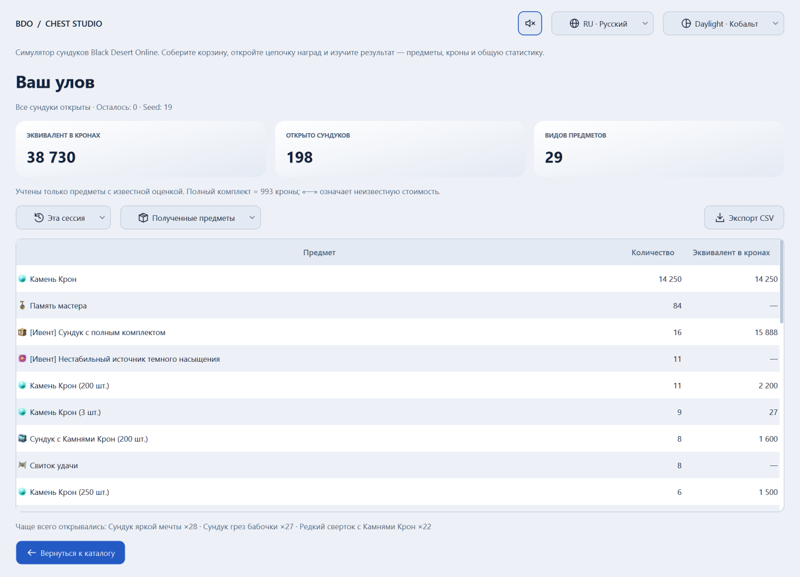

<div align="center">

# BDO Chest Studio

**Соберите корзину. Откройте цепочку сундуков. Изучите свою удачу.**

Локальный симулятор открытия сундуков Black Desert Online с анимациями, темами и статистикой.


[](LICENSE)


[Возможности](#возможности) · [Запуск](#запуск) · [Разработка](docs/DEVELOPMENT.md) · [Добавление сундуков](docs/CONTENT.md) · [Обратная связь](https://github.com/xOstWinDx/BDOChestStudio/issues)

</div>



> **Неофициальный фанатский проект.** Автор не связан с Pearl Abyss, разработчиками или издателями Black Desert Online. Проект не является официальным продуктом, не поддерживается и не одобрен ими. Права на игровые названия и изображения принадлежат соответствующим правообладателям.

## Возможности

- **Одна корзина для разных сундуков.** 18 видов сундуков, поиск на русском и английском, изображения и удобные счётчики.
- **Вложенные открытия.** Выпавшие сундуки автоматически добавляются в очередь — вплоть до конечных предметов.
- **Два способа показать награды.** Рулетка для одиночного дропа; последовательное появление карточек для гарантированных наград и независимых бонусов.
- **Редкость по шансу.** Цветные рамки, количество и вероятность на карточке, мягкое сияние и звуковые эффекты.
- **Результаты и история.** Инвентарь, число открытий, оценка в кронах, общая статистика и экспорт CSV.
- **Четыре темы, два языка.** Midnight, Forest, Sandstone и Daylight; RU/EN с выбором языка системы при первом запуске.
- **Всё локально.** Без аккаунта, подключения к игре и сети во время работы. Звук отключается общей кнопкой в верхней панели.

## Как это выглядит

### Одиночная награда

Рулетка останавливается на уже рассчитанном результате. Анимация не влияет на случайность симуляции.



### Несколько наград

Гарантированный дроп и выпавшие бонусы появляются карточками по очереди. Если наград много, полотно прокручивается к новым карточкам.



### Результаты

Переключайтесь между предметами и открытыми сундуками, смотрите результаты сессии или накопленную статистику.



Скриншоты сняты с настоящего интерфейса. [Сценарий их воспроизведения](scripts/screenshots.py) использует отдельную временную историю и фиксированные seed.

## Запуск

### Готовый exe

Если сборка опубликована, скачайте её на странице [Releases](https://github.com/xOstWinDx/BDOChestStudio/releases), распакуйте архив и запустите `BDOChestStudio.exe`. Установка Python не требуется. Целевая платформа — **Windows 10/11 x64**.

### Из исходников

Понадобится Python 3.12 или новее. Проверяемая версия — Python 3.12 на Windows.

```powershell
git clone https://github.com/xOstWinDx/BDOChestStudio.git
cd BDOChestStudio
py -3.12 -m venv .venv-gui
.\.venv-gui\Scripts\python.exe -m pip install -e .
.\run.ps1
```

После установки пакет также запускается через `python -m bdo_sim` или команду `bdo-chest-studio` в активированном окружении.

1. Найдите сундуки и укажите количество — корзина обновится автоматически.
2. Запустите открытие. Вложенные сундуки попадут в очередь сами.
3. Дождитесь результата, пропустите анимацию или остановите процесс с сохранением уже выпавших наград.

Первые 12 открытий показываются с анимацией, затем включается быстрый режим. Лимит сессии — 1 000 000 открытий; оставшаяся очередь отражается в отчёте.

## Разработка и сборка

```powershell
.\.venv-gui\Scripts\python.exe -m pip install -e ".[dev,build]"
.\.venv-gui\Scripts\python.exe -m ruff check src tests scripts
.\.venv-gui\Scripts\python.exe -m unittest discover -s tests -v
.\build.ps1 -Builder pyinstaller
# Альтернатива с компиляцией; нужен C/C++ toolchain:
.\build.ps1 -Builder nuitka
```

Сборки появляются в `dist/`. Скрипты включают локализации, изображения и звуки. PyInstaller проверяется локально; конфигурация Nuitka подготовлена, но не проверена сборкой в этой версии.

GitHub Actions запускает проверки при push/PR. Ручной workflow **Windows build** собирает exe и сохраняет ZIP-артефакт; он не публикует релиз автоматически.

```text
src/
  launcher.py             вход для сборщиков exe
  bdo_sim/
    app.py                запуск приложения и связывание зависимостей
    domain.py             предметы и механики сундуков
    engine.py             очередь и воспроизводимая симуляция
    definitions.py        Loot, Stage и авторегистрация классов
    content/              конкретные предметы и таблицы дропа
    ui/                   интерфейс, темы, анимации и общий звук
    assets/               изображения, переводы, звуки
scripts/                  сборка и создание скриншотов
tests/                   тесты ядра, UI и контрольные результаты
docs/                    документация и скриншоты
```

Подробнее: [архитектура и проверки](docs/DEVELOPMENT.md), [добавление контента и иконок](docs/CONTENT.md), [участие в разработке](CONTRIBUTING.md), [история изменений](CHANGELOG.md).

## Данные и ограничения

Таблицы перенесены из раннего прототипа и **не сверены с актуальной версией игры**. Симуляция не предсказывает реальные открытия. Оценки в кронах условные; предметы с неизвестной стоимостью не входят в сумму.

История хранится в SQLite в каталоге Qt `AppLocalDataLocation`, обычно `%LOCALAPPDATA%/PetProjects/BDOChestStudio/history.sqlite3`. Для отдельного профиля задайте `BDO_SIM_DATA_DIR`. Язык, тема и звук сохраняются через `QSettings`. Удаление exe не удаляет историю.

## Автор и лицензия

**[xOstWinDx](https://github.com/xOstWinDx) — Старобогатов Алексей Игоревич**  
Контакт: [starobogatov.a@yandex.ru](mailto:starobogatov.a@yandex.ru).

Собственный код проекта распространяется по [MIT License](LICENSE). Эта лицензия **не распространяется на сторонние игровые изображения, товарные знаки и зависимости**. Подробности — в [уведомлениях о сторонних материалах](THIRD_PARTY_NOTICES.md) и [перечне ресурсов](docs/ASSETS.md).

---

**English:** An unofficial offline Black Desert Online chest simulator built with Python and PySide6. Mix chests in a basket, open nested rewards, enjoy reel/card animations and inspect session or lifetime statistics. Russian and English UI. Original code is MIT-licensed; game artwork is excluded. Not affiliated with or endorsed by Pearl Abyss or the game's developers and publishers.
